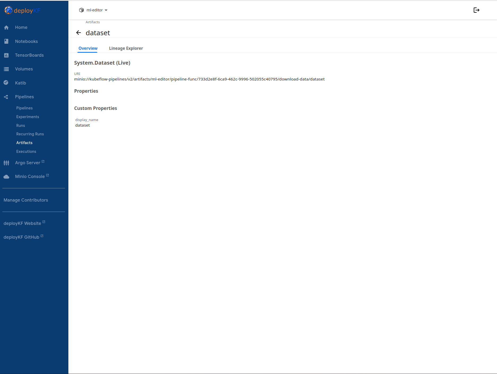

# template_pipeline

Awesome template_pipeline created by ajperry2

## Make Options

Use these make sub arguments for various development utility

|   Command	|   Effect	|
|----------|------:|
|   make help	|   Show the help.	|
|   make install	|  Install the project in dev mode. 	|
|   make fmt	|   Format code using black & isort.	|
|   make lint	|   Run pep8, black, mypy linters.	|
|   make clean	|   Clean unused files.	|
|   make virtualenv	|   Create a virtual environment.	|
|   make release	|   Create a new tag for release.	|
|   make docs	|   Build the documentation.	|

## Running

---

### Downloading Data

- go to the [mapillary](https://www.mapillary.com/) website
- Follow the Path Developers > Image Datasets
- Select "Mapillary Vistas Dataset" > Learn More
- Click "Download dataset" and accept the terms of use
- Right click the v2 link "copy url"
- Paste URL into this command to launch a run which downloads the data and saves it:
    `make launch pipeline=download_data optional_args="url=DATASET_URL"`
- **Note**: Make sure to escape &'s with a \\ character

You can see the artifact is created here:

